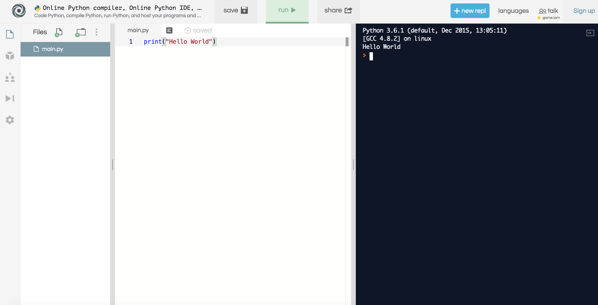

---?color=#1E1F21
# Introduction to Python

---?color=#1E1F21
## Before we get started

---?color=#1E1F21
## Online Editor
https://repl.it/languages/python3

---?color=#1E1F21
## GIT Repo
https://github.com/erwindev/shecancodeit

---?color=#1E1F21
## Presentation
https://gitpitch.com/erwindev/shecancodeit

---?code=src/helloworld.py&lang=Python&color=#1E1F21&title=Your Very First Code: Hello World

---?color=#1E1F21
## Comments
* Comments are any text to the right of the # symbol and is mainly useful as notes for the reader of the program.

---?code=src/comments.py&lang=Python&color=#1E1F21&title=Comments
@[1-3]
@[5]
@[7-8]
@[1-8]

---?color=#1E1F21
## Strings
* A string is a sequence of characters.
* Strings are basically just a bunch of words.  

---?code=src/strings.py&lang=Python&color=#1E1F21&title=Strings
@[1-2]
@[4-5]
@[7-11]
@[1-11]

---?color=#1E1F21
## Variables
* Use variables to store any information
* Manipulate the information stored in the variable

---?code=src/variables.py&lang=Python&color=#1E1F21&title=Variables
@[1-4]
@[6-8]
@[10-12]
@[1-12]

---?color=#1E1F21
## Logical and Physical Line
* A physical line is what you see when you write the program.
* A logical line is what Python sees as a single statement.
* Python implicitly assumes that each physical line corresponds to a logical line.

---?code=src/lines.py&lang=Python&color=#1E1F21&title=Logical and Physical Line
@[1-3]
@[5]
@[7]
@[1-7]

---?color=#1E1F21
## Indentation
* Whitespace is important in Python.
* Leading whitespace (spaces and tabs) at the beginning of the logical line determines indentation
* Statements that must go together must have the same indentation

---?code=src/indentations.py&lang=Python&color=#1E1F21&title=Indentation
@[8-10]
@[1-6]
@[1-10]

---?color=#1E1F21
## Expressions and Operators
* Most statements (logical lines) that you write will contain expressions
* Expressions are functionality that do something and can be represented by symbols such as `+` or by special keywords.
* Operators require some data to operate on and such data is called operands.
* In the example, `1 + 2`, `2` and `3` are operands

---?color=#1E1F21
## Operators
* `+` (plus)
* `-` (minus)
* `*` (multiply)
* `**` (power) `2 ** 3` gives `8` (i.e. `2 * 2 * 2`)
* `/` (divide)

---?color=#1E1F21
## Operators
* `%` (modulo)
  * returns the remainder of the division
  * `15 % 2` gives `1`
  * `8 % 4` gives `0`

---?color=#1E1F21
## Operators
* `<` (less than)
  * `x < y` returns `True` or `False`
* `>` (greater than)
  * `x > y` returns `True` or `False`
* `<=` (less than or equal to)
  * `x <= y` returns `True` or `False`
* `>=` (greater than or equal to)
  * `x >= y` returns `True` or `False`

---?color=#1E1F21
## Operators
* `==` (equal to)
  * `x == y` returns `True` or `False`
* `!=` (not equal to)
  * `x != y` returns `True` or `False`  

---?color=#1E1F21
## Operators
* `not` (boolean NOT)
  * If x is True, it returns `False`. If x is `False`, it returns `True`.
* `and` (boolean AND)
  * `x and y` returns `False` if x is `False`, else it returns evaluation of y
* `or` (boolean OR)
  * If x is `True`, it returns `True`, else it returns evaluation of y

---?code=src/operators.py&lang=Python&color=#1E1F21&title=Operators
@[1-3]
@[5-7]
@[9-11]
@[13-15]
@[17-21]
@[23-24]
@[26-27]
@[29-30]
@[32-33]
@[35-37]
@[39-40]
@[42-43]
@[45-47]
@[49-52]
@[1-52]

---?color=#1E1F21
## Evaluate
`2 + 3 * 5 = ?`

---?color=#1E1F21
## Evaluate
* `(2 + 3) * 5 = ?`
* `2 + (3 * 5) = ?`

---?color=#1E1F21
## Order of Operation
* To make the expressions more readable, we can use parentheses.
* `2 + 3 * 5 == 2 + (3 * 5)` returns True

---?color=#1E1F21
## Order of Operation
https://docs.python.org/3/reference/expressions.html#operator-precedence

---?color=#1E1F21
## Exercise
* Write code that will calculate a volume of a sphere
* Write code that will calculate surface area of a cube

---?code=src/exercise1.py&lang=Python&color=#1E1F21&title=Exercise
@[1-4]
@[6-8]
@[1-8]

---?color=#1E1F21
## Control Flow: if
* if statement is used to check a condition
* if the condition is true, we run a block of statements (called the if-block)
* else we process another block of statements (called the else-block)

---?code=src/guess.py&lang=Python&color=#1E1F21&title=Control Flow: if
@[8-14]
@[1-18]

---?color=#1E1F21
## Control Flow: while
* while statement allows you to repeatedly execute a block of statements as long as a condition is true
* looping statement
* can have an optional else clause

---?code=src/guess.py&lang=Python&color=#1E1F21&title=Control Flow: while
@[5-16]
@[1-18]

---?color=#1E1F21
## Control Flow: for
* for..in statement is another looping statement which iterates over a sequence of objects

---?code=src/for.py&lang=Python&color=#1E1F21&title=Control Flow: for
@[1-4]
@[6-11]
@[1-11]

---?color=#1E1F21
## Exercise
* Write a program which takes in a string as an input and returns true if all the parentheses in the string are properly closed and nested.

((lambda (arg) (+ arg 1)) 5)

---?code=src/exercise2.py&lang=Python&color=#1E1F21&title=Exercise
@[1]
@[3]
@[4-8]
@[10-13]
@[1-13]

---?image=assets/img/last.jpeg
@snap[north span-100 headline]
## Go Forth and CODE
@snapend
